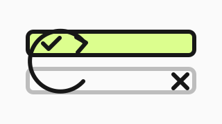
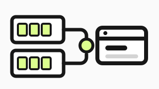
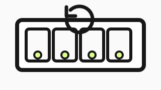
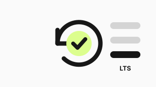
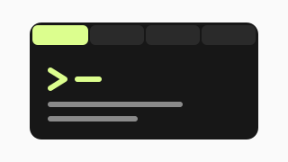
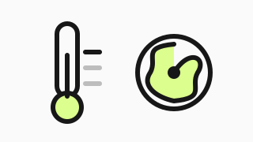
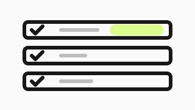
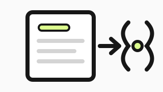
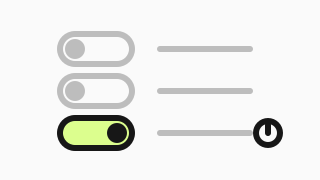
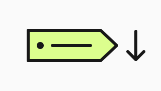

---
hide:
  - navigation
  - toc
---

Features
# Thirteen things this board does that it did not before

Every one of them started as something that went wrong on a real board. The short version is on the plates; behind each is the argument, with the measurement that backs it and the date it was taken.

-   

    [A bad image undoes itself](updates-that-undo-themselves.md)

    Boots on trial and reverts by itself if the board does not come back right. 18 updates, 1 automatic rollback, 0 trips to the rack.

-   

    [One page over every board](one-page-over-every-board.md)

    A board that can reflash four computers should not face the internet. One page in the cluster drives them all, with every control the board has, and holds no credential of its own.

-   

    [Update without touching your nodes](update-without-touching-your-nodes.md)

    Upstream power-cycles all four compute modules to patch the BMC. Measured here on a live cluster: 0 modules cycled, 0 nodes lost.

-   

    [Fresh, and fixed](fresh-and-fixed.md)

    A longterm kernel and a supported Buildroot, 66 releases, and six named faults taken out — including the one that killed the board twice in a day.

-   

    [A console to every module](a-console-to-every-module.md)

    Four serial consoles in the browser, each replaying the 16 KiB the daemon kept before you opened the tab. No adapter, no header.

-   

    [See what the board sees](see-what-the-board-sees.md)

    The temperature sensor upstream never described, and a fan that can tell you which trip point put it where it is.

-   

    [Pick a version, from anywhere](pick-a-version.md)

    This fork, upstream, or the SD card. Every candidate checksum-verified, and compared numerically so 2.10 is not older than 2.9.

-   

    [The board describes its own API](the-board-describes-itself.md)

    OpenAPI 3.1, served by the board. This site's reference and the interface's own types are both generated from it.

-   

    [A certificate that does not rot](a-certificate-that-does-not-rot.md)

    Stock ships one no browser can accept, valid thirty days, never replaced. This one is named, renews itself, and refuses to overwrite yours.

-   

    [Metrics, on their own port](../reference/metrics.md)

    Every family the board can measure, on a listener that holds no credential and can reach nothing else.

-   

    [Power and USB, per module](../reference/cli.md)

    Power, reset, USB routing and flashing, from the browser, the API and the command line alike.

-   

    [Network and time](../reference/api/network.md)

    Ports and link state per module, an NTP source you can set, and whether the clock actually synchronised.

-   

    [Name it, back it up](../reference/api/board.md)

    The hostname and the clock are controls, the whole configuration backs up and restores, and `tpi` reaches every one of them.

<a href="../#demo/fork"><b>See it working →</b>Three interfaces — stock, this fork, and the page over every board — all answering from data captured off real hardware.</a>
<a href="../about/"><b>Why this fork exists →</b>What upstream does, what changed, and what is still not fixed.</a>
<a href="../guides/"><b>Put it on your board →</b>Install, upgrade from stock, and what to do when a flash goes wrong.</a>

