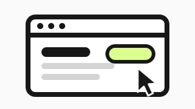
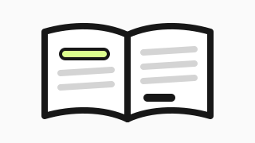
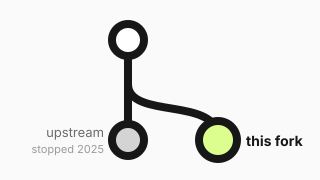

---
hide:
  - navigation
  - toc
---

<nav class="tp-seg tp-switch" aria-label="View">
<a href="#overview" data-view="home">Overview</a>
<a href="#demo/fork" data-view="demo">Live demo</a>
</nav>
<nav class="tp-seg tp-panes" aria-label="Which interface" hidden="hidden">
<a href="#demo/stock" data-pane="stock">Stock firmware</a>
<a href="#demo/fork" data-pane="fork">This fork</a>
<a href="#demo/fleet" data-pane="fleet">turing-fleet</a>
</nav>

<section class="tp-view tp-view--home" markdown>

# Firmware for the Turing Pi 2 that undoes its own mistakes

Upstream stopped in February 2025. This fork keeps the board on a supported kernel, makes a bad flash undo itself, and reads the sensors the hardware always had.

<a class="md-button md-button--primary" href="#demo/fork">Try it, live</a> <a class="md-button" href="guides/install/">Install it</a> <a class="md-button" href="guides/upgrade-from-stock/">Coming from stock?</a>

<b>Flash it wrong and lose nothing.</b>A new image boots on trial and is kept only if the board comes back right. On this board: 18 updates, 1 automatic rollback, 0 trips to the rack — [read off the board](reference/gate-history.md).

<b>Update the BMC without touching your nodes.</b>Upstream power-cycles all four compute modules during a firmware update. This fork leaves their rails alone.

<b>Software that is still maintained.</b>Kernel 6.12 LTS on Buildroot 2025.02 LTS. Upstream ships 6.8 on an end-of-life Buildroot, and its last release was February 2025.

<a class="tp-dest__card" href="#demo/fork"><b>Live demo</b>Stock and this fork, side by side, answering from a real board's data. Click anything.</a>
<a class="tp-dest__card" href="features/"><b>Features</b>Self-undoing updates, a console to every module, the sensor upstream never read.</a>
<a class="tp-dest__card" href="guides/"><b>Documentation</b>Install, upgrade from stock, recover a bad flash, monitor it, and the full API.</a>
<a class="tp-dest__card" href="about/"><b>About</b>Why the fork exists, what changed against upstream, and what is still not fixed.</a>

</section>

<section class="tp-view tp-view--demo" hidden="hidden">

<iframe data-pane="stock" data-src="demo/stock/" title="Stock Turing Pi 2 interface, demo" hidden="hidden"></iframe>
<iframe data-pane="fork" data-src="demo/fork/" title="This fork's interface, demo" hidden="hidden"></iframe>

<h2>turing-fleet</h2>
One interface over every board. It is the next thing being built, and this space is honest about that rather than showing a mock-up.

Every reading is the board's own, captured off real hardware. Controls refuse and say why. The console replays a recording. <a href="about/#the-demo">What is and isn't real</a> · <a href="demo/fork/" target="_blank" rel="noopener">open this fork full size</a> · <a href="demo/stock/" target="_blank" rel="noopener">open stock full size</a>

</section>

